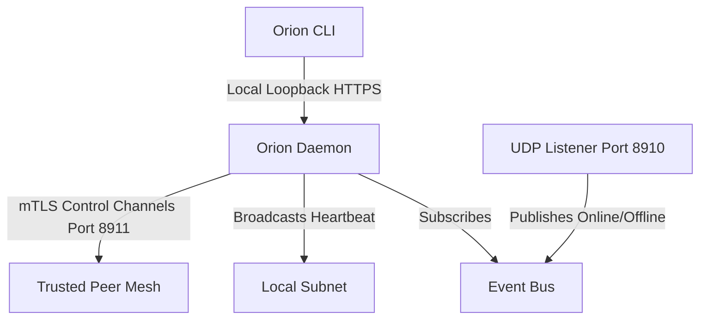
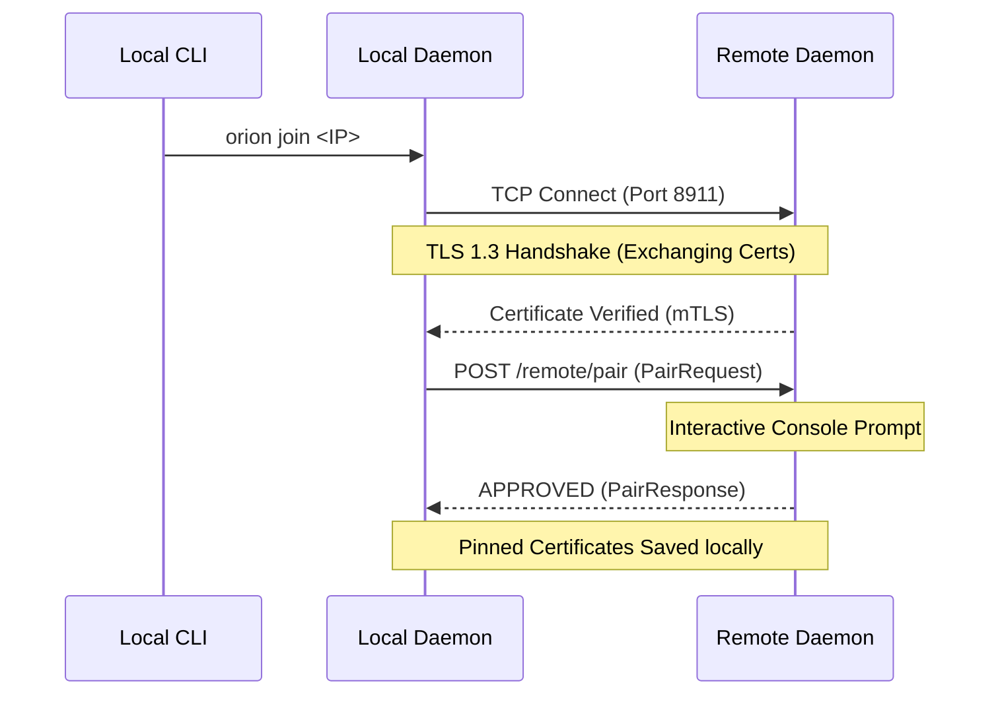

# Orion

[](https://github.com/orion-infra/orion/actions/workflows/ci.yml)
[](https://github.com/orion-infra/orion)
[](LICENSE)
[](https://github.com/orion-infra/orion)
[](https://github.com/orion-infra/orion/releases)
[](https://github.com/orion-infra/orion/stargazers)
[](https://github.com/orion-infra/orion/issues)
[](https://github.com/orion-infra/orion/pulls)
[](https://github.com/orion-infra/orion/actions/workflows/codeql.yml)

**Turn the computers you already own into one secure offline compute mesh.**

Orion is a zero-configuration, secure, local-only developer compute mesh utility. It connects your laptops, desktops, and edge devices over your local area network (LAN), enabling you to share and manage CPU, GPU, memory, and AI hardware resources offline. The mission of Orion is to unify fragmented personal computers into a single, cohesive local computing cluster.

---

## 📖 Table of Contents

1. [Introduction & Hero Section](#-hero-section)
2. [Feature Roadmap](#-feature-roadmap)
3. [Architecture Overview](#-architecture-overview)
4. [Pairing Flow](#-pairing-flow)
5. [Installation](#%EF%B8%8F-installation)
6. [Quick Start](#-quick-start)
7. [CLI Reference](#-cli-reference)
8. [Interactive Terminal Screens](#-terminal-visuals)
9. [Security Design](#-security-design)
10. [FAQ](#%EF%B8%8F-faq)
11. [Roadmap](#-release-roadmap)
12. [Repository Structure](#-repository-structure)
13. [Contributing](#-contributing)
14. [Development Guidelines](#-development-guidelines)
15. [Documentation Index](#-documentation-index)
16. [License & Acknowledgements](#-license)

---

## 🚀 Hero Section

### The Problem
Modern developers often own multiple computers: a personal laptop, a work machine, a desktop workstation, or older hardware sitting in a drawer. However, this computing power is fragmented. When running large workloads—such as local LLMs, compilation jobs, or hardware testing—a single machine hits physical limits (VRAM, thermal throttling, memory capacity) while idle devices sitting on the same network go unused.

### Why Orion Exists
Orion unifies this fragmented power. It creates a local-only mesh that advertises resources, checks health, and securely coordinates workloads across your devices. It requires no cloud coordination, no internet connections, and no centralized databases.

### Who It Is For
*   **AI Developers** looking to aggregate local GPU VRAM to run larger models than their laptops can fit.
*   **Hackathon Teams** who want to pool computing resources (e.g. sharing an Ollama instance or GPU compiler nodes) locally without relying on venue Wi-Fi.
*   **Privacy-First Engineers** who require total data isolation without leaking code, models, or data to cloud servers.

### Why Orion is Different
Unlike cloud orchestration frameworks or centralized VPN solutions:
*   **Zero-Configuration Discovery**: Devices announce themselves on your local subnet automatically using UDP heartbeats.
*   **Mutual TLS Pinning**: Direct trust relationships are established on-device via key exchanges. There are no corporate CAs, no cloud routing relays, and no accounts.
*   **Offline-First**: It is engineered to run in airplane cabin subnets, home networks, or isolated office LANs. If your local ethernet switch is powered on, Orion works.

---

## ✨ Features

### Available Today (v0.1.0-beta)
*   **Secure Device Identity**: ECDSA P-256 private keys and self-signed X.509 certificates generated on `init`.
*   **Zero-Config UDP Discovery**: Heartbeat broadcasting over UDP port `8910` for passive discovery.
*   **Mutual TLS Encryption**: Strict mTLS (TLS 1.3) wrapping all TCP control traffic on port `8911`.
*   **Trust Lifecycle**: Handshake consent prompts are automatically intercepted during normal CLI command execution.
*   **Active Link Transport Detection**: Profiles network interface speeds to dynamically determine connection modes (`Wi-Fi`, `Ethernet`, `USB`, `Bluetooth`, `Loopback`).
*   **Resource & Capabilities Advertising**: Shares hardware parameters, CUDA support, OS specifications, and model states during handshakes.
*   **Ollama Introspection**: Queries local Ollama APIs to determine running/idle states and model quantization details.
*   **Network Diagnostics**: Measures ping latency, control handshake latency, and estimates transport bandwidth.
*   **Diagnostic Doctor**: Complete verification of TLS configs, port status, daemon health, and local hardware.

### Coming Soon (v0.2.x)
*   **Distributed AI Runtime**: Orchestrate local compilation and execution.
*   **Model Sharding (Pipeline Parallelism)**: Slice weight matrices across laptops proportional to VRAM capacity via llama.cpp RPC integrations.
*   **GPU-Aware Scheduler**: Route queries automatically to the node with the fastest latency, highest VRAM, or pre-loaded weights.

### Future Vision (v0.3+)
*   **Dynamic Dropout Recovery**: Gracefully migrate active execution layers if a laptop's lid is closed or it drops off Wi-Fi.
*   **Continuous Batching Engine**: Pipeline multiple concurrent developer completions over the local mesh.

---

## 📐 Architecture Overview

Orion splits operations into a lightweight CLI frontend and a background coordinator daemon. 

### Local System Control Loop
The CLI queries the local daemon over loopback HTTPS. The daemon maintains peer states and coordinates P2P discovery:



### Peer-to-Peer mTLS Handshake
Every remote request (pairing, resource query, or job execution) runs over a mutual-TLS tunnel where both client and server certificates are validated against pinned copies:



---

## 🤝 Pairing Flow

Establishing trust between two machines uses a simple, user-authorized handshake:


---

## ⚙️ Installation

Orion compiles into a single, lightweight binary.

### Build From Source (Cross-Platform)
Ensure you have Go 1.22+ installed, then compile the executable:
```bash
git clone https://github.com/orion-infra/orion.git
cd orion
go build -ldflags="-s -w" -o orion ./cmd/orion
```

### Installation Script
For convenience, copy the compiled binary to your system PATH:

#### macOS / Linux
```bash
sudo mv orion /usr/local/bin/
```

#### Windows (PowerShell Administrator)
```powershell
Move-Item orion.exe C:\Windows\System32\
```

---

## ⚡ Quick Start

### Step 1: Initialize Identity
Generate your local cryptographic identity and default configuration file:
```bash
orion init
```
This generates:
*   A unique ECDSA P-256 private key and self-signed X.509 certificate.
*   A user-friendly device identifier (e.g. `ORN-9AF2-81D7`).

### Step 2: Launch the Daemon
Orion commands automatically spawn the background daemon when needed. To start it manually or check its state:
```bash
orion status
```

### Step 3: Discover & Pair
Find other Orion nodes broadcasting on your local network:
```bash
orion connect
```
Select a peer node using the TUI and press **Enter** to issue a pairing request.

### Step 4: Accept Connection
On the target machine, running any Orion command (e.g. `orion respond`) intercepts execution to show the connection prompt:
```text
  Incoming Connection Request
  Device:       Victus-Laptop
  ID:           ORN-9AF2-81D7
  Fingerprint:  8F:E1:12:A2

  Accept? [Y] Accept [N] Reject > y
```
Once approved, certificates are pinned on both machines.

---

## 💻 CLI Reference

Orion provides a clean, human-centric command interface:

| Command | Description | Example | Status |
| ------- | ----------- | ------- | ------ |
| `init` | Generate local keypairs & unique device identity | `orion init` | ✅ Ready |
| `status` | Display mesh statistics and daemon status | `orion status` | ✅ Ready |
| `connect` | Open TUI to discover and pair with nearby devices | `orion connect` | ✅ Ready |
| `devices` | List paired devices (`--verbose` for certificates) | `orion devices -v` | ✅ Ready |
| `hardware` | Profile CPU, RAM, GPU, VRAM, and CUDA details | `orion hardware` | ✅ Ready |
| `models` | List all local and remote Ollama models on the mesh | `orion models` | ✅ Ready |
| `benchmark` | Run network ping, handshake, and transport diagnostics | `orion benchmark` | ✅ Ready |
| `run` | Execute shell commands on a paired machine | `orion run uname -a` | ✅ Ready |
| `doctor` | Verify local ports, configurations, and TLS states | `orion doctor` | ✅ Ready |
| `remove` | Revoke trust and unlink a paired remote device | `orion remove ORN-9AF` | ✅ Ready |

---

## 📸 Terminal Visuals

### Orion Mesh Health (`orion status`)
```text
 Mesh  Healthy

──────────────────────────────────────────────────────────

   Devices     3
   Online      3
   Trusted     2
   Protocol    1
   Discovery   Active
   TLS         Enabled
   Daemon      Running
```

### Orion Diagnostics (`orion doctor`)
```text
 Orion Doctor - Diagnostics

   [OK] Daemon          Running on port 8911
   [OK] Certificates    Valid (ECDSA P-256 Keypair)
   [OK] TLS             mTLS Enabled (TLS 1.3)
   [OK] Ports           Ports 8910/8911 available
   [OK] Discovery       Active
   [OK] Protocol        Version 1 (Compatible)
   [OK] Hardware        CPU: 13th Gen Intel(R) Core(TM) i5-13420H, RAM: 16 GB
   [OK] GPU             Discrete GPU Detected: NVIDIA GeForce RTX 4050 Laptop GPU
   [OK] Ollama          Running (v0.31.1)
   [OK] Network         Interface: Wi-Fi (Up)
```

---

## 🔒 Security Design

Orion is engineered for Zero-Trust local networks:

*   **Mutual TLS 1.3 (mTLS)**: Every peer connection mandates clients to present valid certificates. Unrecognized or unpinned connections are terminated during the TLS handshake before any control requests are processed.
*   **Direct Certificate Pinning**: By pinning X.509 certificates directly in `config.json` upon user consent, Orion bypasses corporate certificate authorities (CAs) and operates offline.
*   **Zero-Cloud Footprint**: Orion has no accounts, transmits no telemetry, and connects to no external servers. 
*   **Strict Boundary Constraints**: The remote job runner (`orion run`) is disabled for unlinked machines. Removing a device via `orion remove` instantly deletes its pinned certificate from the database, rendering subsequent connection handshakes impossible.

---

## 💬 FAQ

### Q: Does Orion require an internet connection?
No. Orion is built to operate fully offline. It uses UDP local subnet broadcasts for discovery and direct TCP connections for control API routing.

### Q: How is Orion different from Tailscale?
Tailscale is a corporate VPN overlay (Virtual Private Network) designed to route traffic across the internet using WireGuard. Orion is a developer resource mesh. Orion doesn't tunnel your system internet traffic; it profiles hardware, discovers LLM weights, and schedules local jobs across nearby physical computers.

### Q: Does Orion upload my models or data?
Never. Orion operates entirely on your physical LAN. Models, prompt contexts, and executions never leave your local ethernet cables or Wi-Fi subnets.

### Q: Can I revoke trust?
Yes. Running `orion remove <device-id>` permanently deletes that device's pinned certificate from your configuration. Any subsequent requests from that machine are blocked at the TLS handshake level.

---

## 🗺️ Release Roadmap

| Version | Focus | Status |
| ------- | ----- | ------ |
| **v0.1.0-beta** | Secure Identity, mTLS, UDP Discovery, Diagnostics, TUI | ✅ Completed |
| **v0.2.0-beta** | llama.cpp RPC, Pipeline parallel layer sharding, GPU scheduler | 📋 Planned |
| **v0.3.0-beta** | Cluster Topology Map, Failover recovery, VRAM allocations TUI | 📋 Planned |

---

## 📁 Repository Structure

```text
├── .github/                 # GitHub workflows (CI, CodeQL, release drafts)
│   ├── ISSUE_TEMPLATE/      # Structured issue forms (bug reports, enhancements)
│   └── workflows/
├── cmd/
│   └── orion/               # CLI Entrypoint main.go
├── docs/                    # Technical spec architectures and manuals
│   ├── architecture.md
│   ├── security.md
│   ├── networking.md
│   └── protocol.md
├── internal/
│   ├── cli/                 # CLI Command execution frameworks (cobra commands)
│   ├── core/                # EventBus, network daemons, cryptography, profiling
│   └── ui/                  # Premium console typography and formatters
├── .editorconfig            # Indentation rules and line-ending standards
├── .gitattributes           # Git checkout normalization parameters
└── .gitignore               # Comprehensive patterns protecting machine secrets
```

---

## 🛠️ Development Guidelines

### Run Tests
```bash
go test -count=1 ./...
```

### Static Analysis
```bash
go vet ./...
```

---

## 📚 Documentation Index

For in-depth analysis of protocols and architectural workflows:
*   [Getting Started Guide](docs/getting-started.md)
*   [Internal Architecture Design](docs/architecture.md)
*   [Network Protocol Specifications](docs/protocol.md)
*   [Link Transport & Networking](docs/networking.md)
*   [Security & P2P Cryptography](docs/security.md)
*   [Roadmap Details](docs/roadmap.md)
*   [FAQ Reference Manual](docs/faq.md)

---

## 📄 License

Orion is open-source software licensed under the [Apache-2.0 License](LICENSE).
